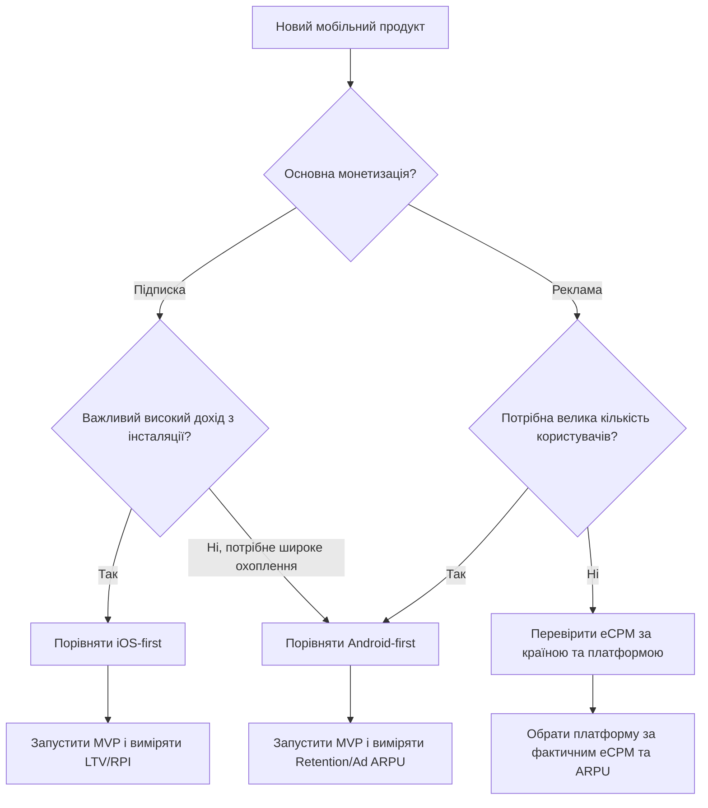

[README(1) (1).md](https://github.com/user-attachments/files/32443583/README.1.1.md)
# Варіант 4: Економіка платформ — Android vs iOS

## 1. Мета

Порівняти Android та iOS з погляду монетизації мобільного продукту та визначити умови, за яких доцільніше починати запуск з однієї з платформ.

Аналіз виконано за даними, доступними станом на **20 вересня 2026 року**.

---

## 2. Вихідні дані
### Додатковий аналіз монетизації

Для subscription-моделі важливо порівнювати не лише кількість
користувачів, а й дохід з однієї інсталяції, конверсію в оплату,
retention та LTV.
### 2.1. Частка мобільних ОС

За StatCounter за **серпень 2026 року**:

| Ринок | Android | iOS |
|---|---:|---:|
| Світ | 67,61% | 32,36% |
| Україна | 64,20% | 35,73% |

Таким чином, Android має більшу потенційну аудиторію за кількістю пристроїв. Водночас частка iOS в Україні є значною — понад третину мобільного ринку.

Джерела:
- https://gs.statcounter.com/os-market-share/mobile
- https://gs.statcounter.com/os-market-share/mobile/ukraine

### 2.2. Монетизація користувача

Універсального ARPU для всіх мобільних застосунків немає: він сильно залежить від категорії, країни, моделі монетизації та поведінки користувачів.

Для порівняння використано відкритий benchmark RevenueCat для **subscription apps** — медіанний дохід на інсталяцію через 60 днів (D60 RPI):

| Платформа | D60 RPI |
|---|---:|
| App Store / iOS | $0,42 |
| Google Play / Android | $0,16 |

Тобто в наборі даних RevenueCat медіанна монетизація однієї інсталяції за 60 днів на iOS становила $0,42, а на Android — $0,16. Це **не середній дохід усіх користувачів світу**, а benchmark для застосунків із підпискою, тому його потрібно використовувати саме як орієнтир для фінансової моделі.

Джерело:
- https://www.revenuecat.com/state-of-subscription-apps

### 2.3. Комісії магазинів

#### Apple App Store

Для стандартних продажів цифрових товарів Apple вказує комісію 30%. Для учасників **App Store Small Business Program** ставка становить 15%. Для автоматично поновлюваних підписок після одного року оплаченої підписки комісія також знижується до 15%; для учасників Small Business Program — 15% від початку.

Джерела:
- https://developer.apple.com/programs/whats-included/
- https://developer.apple.com/app-store/subscriptions/

#### Google Play

Для більшості ринків, де нова модель ще не запущена, Google Play вказує 15% для автоматично поновлюваних підписок. Для EEA, Великої Британії та США нова структура комісій почала діяти з 30 червня 2026 року: для підписок — 10% service fee + 5% billing fee, тобто 15% у стандартному випадку.

Важливо: правила Google Play у 2026 році змінюються поетапно, тому конкретна комісія залежить від країни, типу покупки та статусу інсталяції.

Джерела:
- https://support.google.com/googleplay/android-developer/answer/112622
- https://support.google.com/googleplay/android-developer/answer/16954621

---

## 3. Порівняння платформ

| Критерій | Android | iOS |
|---|---|---|
| Світова частка мобільних ОС | 67,61% | 32,36% |
| Частка в Україні | 64,20% | 35,73% |
| Benchmark D60 RPI для subscription apps | $0,16 | $0,42 |
| Основний магазин | Google Play | App Store |
| Типова комісія для підписки | 15% у більшості ринків; у новій моделі Google — 10% + 5% billing fee | 15% для Small Business Program / після 1 року підписки |
| Перевага для масового охоплення | Більша аудиторія | Менша аудиторія |
| Перевага для subscription-моделі | Нижчий benchmark RPI | Вищий benchmark RPI |
| Вартість публікації | Android Developer Console: одноразово $25 | Apple Developer Program: $99/рік |
| Особливість розробки | Велика різноманітність пристроїв | Потрібне середовище macOS для нативної iOS-збірки через Xcode |

Джерела вартості акаунтів:
- https://support.google.com/android-developer-console/answer/16604405
- https://developer.apple.com/programs/enroll/

Щодо iOS-збірки: Apple Xcode підтримує розробку та збірку iOS-застосунків на macOS. Актуальні системні вимоги Xcode публікує Apple:
- https://developer.apple.com/xcode/system-requirements/

---

## 4. Фінансова модель

Щоб порівняння було відтворюваним, приймаємо такі **умовні параметри навчального розрахунку**:

- ціна підписки: **$9,99/місяць**;
- 1 000 активних платних користувачів;
- комісія магазину: **15%**;
- податки, сервери, маркетинг та зарплата команди в базовому розрахунку не враховуються;
- для оцінки монетизації використовуємо D60 RPI RevenueCat.

### 4.1. Дохід з 1 000 інсталяцій за benchmark D60

Формула:

`Дохід = кількість інсталяцій × D60 RPI`

| Платформа | 1 000 інсталяцій | D60 RPI | Орієнтовний дохід |
|---|---:|---:|---:|
| iOS | 1 000 | $0,42 | $420 |
| Android | 1 000 | $0,16 | $160 |

За цим benchmark монетизація iOS-інсталяцій приблизно у **2,63 раза** вища:

`0,42 / 0,16 ≈ 2,63`

Цей коефіцієнт не означає, що будь-який конкретний iOS-користувач гарантовано принесе у 2,63 раза більше доходу. Це лише різниця медіанних показників у дослідженні RevenueCat.

### 4.2. Приклад для 10 000 інсталяцій

| Платформа | D60 RPI | Дохід до комісії |
|---|---:|---:|
| iOS | $0,42 | $4 200 |
| Android | $0,16 | $1 600 |

За умовної комісії 15%:

| Платформа | Дохід | Комісія 15% | Після комісії |
|---|---:|---:|---:|
| iOS | $4 200 | $630 | $3 570 |
| Android | $1 600 | $240 | $1 360 |

Це спрощений сценарій. Реальна сума залежатиме від країни користувача, податків, конкретного типу платежу та умов магазину.

---

## 5. Вартість розробки та точка беззбитковості

Для навчального прикладу вводимо такі **припущення**, а не ринкові факти:

- Android MVP: **$6 000**;
- iOS MVP: **$7 500**;
- додаткові $1 500 для iOS пояснюємо витратами на окрему платформну реалізацію, тестування та вимогою macOS/Xcode;
- ці суми потрібно замінити фактичним бюджетом конкретного проєкту.

### Точка беззбитковості

Формула:

`Break-even installs = Вартість розробки / чистий дохід на інсталяцію`

За умовної комісії 15%:

- iOS: `$0,42 × 0,85 = $0,357`
- Android: `$0,16 × 0,85 = $0,136`

Тоді:

- iOS: `$7 500 / $0,357 ≈ 21 008 інсталяцій`
- Android: `$6 000 / $0,136 ≈ 44 118 інсталяцій`

Отже, **за заданих саме навчальних припущень** iOS швидше покриває витрати розробки при однаковій кількості якісних інсталяцій.

---

## 6. Коли починати з iOS, а коли з Android

### Сценарій A — спочатку iOS

Початок з iOS має сенс, якщо:

1. Основний продукт працює за моделлю **підписки**.
2. Цільова аудиторія знаходиться на ринках із високою платоспроможністю.
3. Команда може забезпечити macOS/Xcode для розробки та CI/CD.
4. Потрібно перевірити willingness-to-pay на невеликій, але більш монетизованій аудиторії.
5. У бізнес-моделі важливі LTV та дохід з інсталяції більше, ніж максимальне охоплення.

RevenueCat у звіті 2026 року наводить медіанний D60 RPI $0,42 для App Store проти $0,16 для Google Play серед subscription apps.

### Сценарій B — спочатку Android

Початок з Android має сенс, якщо:

1. Основна мета — **максимальне охоплення**.
2. Продукт монетизується переважно рекламою.
3. Цільовий ринок має більшу частку Android-користувачів.
4. Продукт потребує великої кількості користувачів для мережевого ефекту або збору поведінкових даних.
5. Команда хоче почати з нижчих витрат на реєстрацію магазину: Android Developer Console — одноразовий $25, тоді як Apple Developer Program — $99 на рік.

У світі Android мав 67,61% мобільної ОС-аудиторії у серпні 2026 року, а в Україні — 64,20%.

---

## 7. Модель монетизації №1 — підписка

Підписка передбачає регулярну оплату за доступ до функцій або контенту.

### Рекомендована схема тестування

**Free → Trial → Subscription**

Наприклад:

- безкоштовна базова версія;
- 7-денний trial;
- $9,99/місяць;
- знижка для річного плану.

Для subscription apps важливо аналізувати:

- conversion to trial;
- trial-to-paid;
- churn;
- retention;
- D60/D90 RPI;
- LTV.

RevenueCat у дослідженні 2026 року аналізує понад 115 000 subscription apps і понад $16 млрд відстеженого доходу, тому його benchmark можна використовувати як орієнтир, але не як гарантію результату конкретного застосунку.

Джерело:
https://www.revenuecat.com/state-of-subscription-apps

---

## 8. Модель монетизації №2 — реклама

Для рекламної моделі головними показниками є:

- **eCPM** — дохід на 1 000 рекламних показів;
- impressions per user — кількість показів на користувача;
- retention;
- ARPU / Ad ARPU.

Appodeal визначає Ad ARPU як дохід від реклами, поділений на кількість активних користувачів. eCPM залежить від країни, платформи та формату реклами.

Джерело:
https://docs.appodeal.com/reporting/metrics

За даними Appodeal для 2025 року, eCPM помітно залежить від регіону та формату. Наприклад, у Північній Америці показники interstitial/rewarded video були значно вищими, ніж у LATAM, тому для рекламної моделі географія аудиторії критично важлива.

Джерело:
https://appodeal.com/wp-content/uploads/2025/03/Appodeal-The-Latest-eCPM-Report-2025.pdf

### Практичний висновок для реклами

Для реклами важливіше не лише те, яка ОС має вищий eCPM, а й:

`Дохід ≈ користувачі × покази на користувача × eCPM / 1000`

Тому Android може бути доцільною стартовою платформою, якщо продукт орієнтований на масову аудиторію та велику кількість рекламних показів.

---

## 9. Порівняння двох моделей

| Параметр | Підписка | Реклама |
|---|---|---|
| Головний KPI | LTV, RPI, conversion | eCPM, impressions/user, Ad ARPU |
| Значення платоспроможності | Високе | Середнє/залежить від географії |
| Потрібна велика аудиторія | Не обов'язково | Часто так |
| Підходить для iOS-first | Так, якщо важлива монетизація | Можливо, але треба дивитися eCPM |
| Підходить для Android-first | Так, якщо важливе охоплення | Так, особливо для масових продуктів |
| Основний ризик | Високий churn | Низький дохід з одного користувача |
| Ключовий фактор | Конверсія в платну підписку | Retention + кількість показів + eCPM |

---

## 10. Дерево рішення



---

## 11. Ризики

### Ризик 1 — benchmark не дорівнює результату конкретного застосунку

RevenueCat аналізує subscription apps, а не всі мобільні продукти. Тому $0,42 і $0,16 не можна трактувати як гарантований дохід кожного користувача.

### Ризик 2 — зміна комісій

У 2026 році Google змінює структуру service fee по регіонах. Потрібно перевіряти актуальні правила для країни користувача перед запуском.

### Ризик 3 — macOS для iOS

Нативна iOS-розробка та актуальні версії Xcode прив'язані до macOS. Це створює додаткові вимоги до обладнання або CI/CD.

### Ризик 4 — фрагментація Android

Android має велику кількість моделей пристроїв, розмірів екранів і версій ОС. Це збільшує обсяг тестування.

### Ризик 5 — реклама залежить від географії

Один і той самий застосунок може мати суттєво різний eCPM залежно від країни користувача та формату реклами.

---

## 12. Висновок

За наведеними даними та **умовами навчальної фінансової моделі**:

- **iOS-first** доцільно розглядати для продукту з підпискою, коли ключовим показником є монетизація з інсталяції та цільова аудиторія готова платити;
- **Android-first** доцільно розглядати, коли головним фактором є охоплення, велика кількість користувачів або рекламна модель;
- остаточний вибір потрібно робити після тестового запуску та вимірювання власних **RPI/LTV, conversion, retention, eCPM та ARPU**.

Головний висновок: **платформу потрібно обирати не лише за часткою ринку, а за відповідністю платформи конкретній моделі монетизації та економіці продукту.**

---

## 13. Джерела

1. StatCounter — Mobile OS Market Share Worldwide  
   https://gs.statcounter.com/os-market-share/mobile

2. StatCounter — Mobile OS Market Share Ukraine  
   https://gs.statcounter.com/os-market-share/mobile/ukraine

3. RevenueCat — State of Subscription Apps 2026  
   https://www.revenuecat.com/state-of-subscription-apps

4. Apple — Membership Details  
   https://developer.apple.com/programs/whats-included/

5. Apple — Auto-renewable Subscriptions  
   https://developer.apple.com/app-store/subscriptions/

6. Apple — Xcode System Requirements  
   https://developer.apple.com/xcode/system-requirements

7. Google Play — Service Fees  
   https://support.google.com/googleplay/android-developer/answer/112622

8. Google Play — Understanding Lower Service Fees  
   https://support.google.com/googleplay/android-developer/answer/16954621

9. Google — Android Developer Console registration  
   https://support.google.com/android-developer-console/answer/16604405

10. Appodeal — Metrics  
    https://docs.appodeal.com/reporting/metrics

11. Appodeal — eCPM Report 2025  
    https://appodeal.com/wp-content/uploads/2025/03/Appodeal-The-Latest-eCPM-Report-2025.pdf

---

## 14. Історія комітів для GitHub

Приклад трьох осмислених комітів:

```text
git add README.md
git commit -m "docs: add platform market analysis"

git add README.md
git commit -m "docs: add monetization calculations"

git add README.md
git commit -m "docs: finalize platform decision and risks"
```

## 15. Короткий підсумок

Вибір між Android та iOS залежить від моделі монетизації,
цільової аудиторії та бюджету проєкту.

Для підписної моделі важливо аналізувати дохід з користувача,
а для рекламної моделі — кількість користувачів, retention та eCPM.
